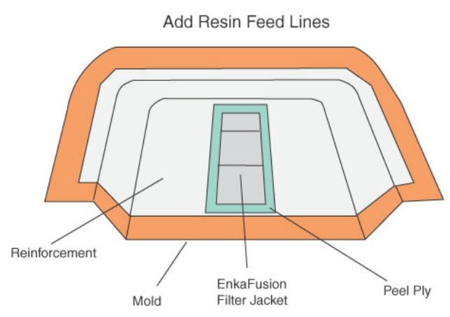
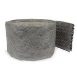

# Vacuum Infusion - The Equipment and Process of Resin Infusion 
## Introduction 
The Vacuum Infusion Process (VIP) is a technique that uses vacuum pressure to drive resin into a laminate. Materials are laid dry into the mold and the vacuum is applied before resin is introduced. Once a complete vacuum is achieved, resin is literally sucked into the laminate via carefully placed tubing. This process is aided by an assortment of supplies and materials. 

In a typical hand lay-up, reinforcements are laid into a mold and manually wet out using brushes, rollers, or through other means. An improvement on that method is to use a vacuum bag to suck excess resin out of the laminate. Vacuum bagging greatly improves the fiber-to-resin ratio, and results in a stronger and lighter product. If you are unfamiliar with vacuum bagging, we recommend reading our brochure, Vacuum Bagging Equipment and Techniques for Room-Temp Applications, as VIP requires experience in this area and uses many of the same principles. 

Vacuum infusion builds upon these principles, providing further improvements to the lamination process. 
## Benefits of Vacuum Infusion 
Vacuum infusion provides a number of improvements over traditionally vacuum bagged parts. 

These benefits include: 

* Better fiber-to-resin ratio 
* Less wasted resin 
* Very consistent resin usage 
* Unlimited set-up time 
* Cleaner 

VIP offers a better fiber-to-resin ratio than vacuum bagging. A typical hand lay-up usually results in excess of 100% fabric weight by resin. Resin alone is very brittle, so any excess will actually weaken the part. Vacuum bagging can reduce this number significantly; however, it is still not ideal and can lead to additional problems. 

While vacuum bagging certainly improves on the hand lay-up, there is still a hand lay-up involved. 

Because of this, the laminate will always begin in an oversaturated state. Vacuum pressure will remove much of the excess resin, but the amount removed still depends on a variety of variables including reinforcement, resin, time factors, and others. 

Vacuum infusion takes a different approach, in that a vacuum is drawn while the materials are still dry. From that point, resin is infused using vacuum pressure. Rather than starting with excess and drawing resin out, VIP starts with none and pushes resin in. Ideally, any excess resin that is introduced will eventually be sucked out into the vacuum line. As a result, only the minimum amount of resin is introduced. This lowers weight, increases strength, and maximizes the properties of fiber and resin. Parts constructed using VIP can approach prepreg levels of resin 
content. 

Due to the nature of VIP, resin usage becomes very predictable. While a standard lay-up varies in resin content due to the human variable, VIP is remarkably consistent. Even when creating a large product, resin usage will be predictably similar upon repeated attempts. This results in less wasted resin, and more importantly, less wasted money. 

Vacuum infusion provides another valuable benefit: time. A frequent problem that can arise in vacuum bagging is the time factor. Many resins have a pot-life of about 30 minutes, though there are certainly some (such as our System 2000 Epoxy) that offer work times of up to 2 hours. 

Even so, that time limit is extremely critical in vacuum bagging applications. Large projects can easily approach the 2 hour mark, and even small, seemingly simple projects can quickly turn frantic when a pesky leak in the vacuum seal cannot be found. Also, depending on when the bag is applied, the amount of resin removed can vary from part to part.

Vacuum infusion, however, offers unlimited set-up time. Because the vacuum is applied while reinforcements are still dry, there is no resin clock to work against. After the bag is applied, leaks can be patiently sought out. If something is not sitting properly, simply release vacuum and readjust. No time constraints are introduced until it is decided that it is time to infuse the resin. 

Until that moment, changes can be made again and again. 

Finally, vacuum infusion is a much cleaner process. There are no brushes or rollers, and therefore no splashing or spattering. No one will be required to hover over an open mold, saturating a laminate by hand, trying not to drip on himself. In addition, there are less resin fumes to contend with. Because the only fumes radiate from the resin reservoir, they are somewhat containable. VIP provides a cleaner, safer, and friendlier work environment, though it is still important to work in a well ventilated area and wear a respirator and other appropriate safety equipment. 

## Potential Pitfalls 
Like any laminating process, VIP is not without its drawbacks. When attempting infusion for the first time, it is important to keep the following ideas in mind. 

* Complicated set-up 
* Easy to ruin a part 
* Trial and error 

Though set-up is time-limit free, it is somewhat more complicated. Vacuum bagging requires the placement of only the vacuum tubing. Vacuum infusion requires not only vacuum tubes but resin inlets as well, not to mention in-bag extensions of these tubes. Placement of these vacuum and resin lines varies from part to part, and there is no one way to set them up. These considerations must be evaluated prior to lay-up, or else the part could be ruined. 

This leads into the next pitfall; it is very easy to destroy a part. Typically, once infusion begins, there is little that can be done to correct any errors. For example, if a leak were to occur, even the smallest amount of air introduced could be potentially fatal to a part. It would probably result in resin pooling, undersaturation, or even a complete stoppage of resin flow. Though there are certainly some cases where problems can be corrected, it should not be expected. The best protection from disaster is careful planning.

Due to the complexity and ease of error, VIP should be viewed as a trial-and-error process. 

The best mindset to have when attempting vacuum infusion for the first time is that a few parts (or more than a few) will be ruined before getting it right. The trick is to carefully document each attempt in order to learn from each trial. Keep track of the resin flow rates. Determine where the resin is reluctant to go and find a way to get it there. Even the smallest modifications can yield drastically different results. Practice with small quantities and inexpensive materials before undertaking full-scale projects. The key is learning from mistakes. This is especially the case when working with larger projects requiring multiple vacuum and resin lines. In a manufacturing environment, it is recommended that at least 6 months are set aside for testing and preparation. 

## VIP Set-up and Equipment

When preparing to experiment with infusion, it is important to understand some general concepts about how materials are used and arranged. Keep in mind that every project is unique and this guide is not intended to provide the only available options. We will discuss some variations later. 

First, the general sequence of events that comprises vacuum infusion is illustrated in the following diagram.

For the purpose of this brochure, we will be focusing on one general set-up idea with the notion that resin will be infused into a center point in the laminate. From there, resin will be pulled outward via vacuum pressure. The final arrangement of materials should look something like this. 

Note: For the purposes of this diagram, the vacuum bag itself is not shown 

With this final goal in mind, let’s take a closer, step-by-step look at what materials are used and how to go about using them.

### Step 1 The Mold 
Prepare your mold 
Select your reinforcement 
Select your flow media and/or core material 
 
### Step 2 Resin and Vacuum Lines 
 Select your resin feed lines 
 Select your vacuum lines 
### Step 3 Vacuum Bag 
 Build your vacuum bag 
 Allow for prohibiting resin from entering the vacuum 
### Step 4 Vacuum Pump 
 Attach the pump 
 Ensure proper vacuum 

### Step 5 Prepare for Infusion 
 Select your resin 
 Resin bucket set-up 

### Step 6 Resin Infusion 
 Catalyze your resin and allow it to start infusing 
 Clamp off resin line 
### Step 7 Experiment and Test for Improvement 
 Helpful supplies for vacuum infusion 
 Typical variations in set-up 
## Step 1 The Mold 
 
### Prepare your mold 
Like any lamination process, a good quality mold is required for vacuum infusion. The mold should be rigid and have a high-gloss finish. Ideally, this mold will have flange of at least 6 inches to be used for the placement of sealant tape and spiral tubing. After the mold is properly cleaned, apply your ordinary, preferred mold release agent. Unique mold releases are not required for resin infusion. 

### Select your reinforcement 
Choosing reinforcement is an important decision for any laminate, but there are additional considerations when choosing one for infusion. While all fabrics will potentially infuse, different materials and weave styles can severely alter resin flow rates. The following offers some general guidelines for choosing materials, though individual experiences may vary. 

**Fiberglass** is the most frequently used reinforcement in vacuum infusion. Most fiberglass fabrics offer high permeability, allowing resin to easily flow through. In general, looser weaves tend to infuse better, as there is less crimping of strands.

When using a non-woven mat, continuous strand mat will offer superior infusion over a chopped-strand. While both offer high permeability, the binder in chopped strand mat somewhat hinders resin flow. Continuous strand mat (#251) will avoid this problem. 

Knit fabrics are frequently used for infusion due to their construction. These fabrics are not woven, but rather are knit together to avoid crimping caused by weaves. The #293 Knit Fabric is 18 oz. fiberglass roving knit to a 1.5 oz. chopped strand mat. This material not only boosts resin flow, but also adds strength and bulk very quickly.

or use [10 oz Fiberglass Fabric Style 750](#10-oz-fiberglass-fabric-style-750)

**Carbon Fiber (Graphite)** and **Kevlar®** reinforcements can also be used in vacuum infusion, though they tend to infuse more slowly. To counteract this, the addition of flow media was found to greatly increase infusion rates and create successful parts using both #1110 Vinyl Ester and #2000 Epoxy resins. It is a good idea to experiment with these materials beforehand in order to properly gauge flows rates.

When working with molds of a more complex shape, dry reinforcement may not readily sit flat. Super 77™ Spray Adhesive (#1404) is the recommended remedy for this problem. Spray a light layer of adhesive on the mold surface and lay down the reinforcement. This should provide enough adhesion to hold the materials in place. When used moderately, Super 77™ will not interfere with the resin infusion or curing process. 

### Select your flow media and/or core material 
#### Flow Media 
A concept unique to vacuum infusion is the idea of flow media. In VIP, resin enters the laminate at a fixed point (or points) and must be directed. Resin will always travel in the path of least resistance. Unfortunately, many reinforcements can provide a great deal of resistance that can prevent resin flow. Aiding the flow of resin is the job of flow media. 

Although it is possible to infuse resin into a reinforcement without the addition of flow media, it is rarely successful. The flow media is typically laid as a single layer between layers of reinforcement to provide an easy flow conduit for resin. This material ultimately becomes part of the laminate. 

Flow media comes in several styles. 

* [EnkaFusion Nylon Matting](#1401-nylon-matting) provides the fastest infusion times. Constructed of randomly oriented, entangled nylon filaments, this matting can typically move resin as fast it can be fed. 
* [Lantor Soric® XF](#1409-nylon-matting) provides maximum conformability. This material is used as both a bulker and flow media. It has hexagonal flow channels that quickly move resin throughout the laminate, while simultaneously adding thickness. Laminates incorporating Soric® can typically experience 35% less resin retention than all glass laminates. Though used as a core, Lantor Soric® does not provide any significant structural properties. 
* [DIVINYMAT Sandwich Core](#1024-divinymat) serves as both a flow media and structural core. This material is similar to traditional vinyl foam cores, but includes grooves, perforations, and scores in the core material to help resin traverse the laminate while simultaneously adding strength and rigidity. Additionally, this material is on a scrim backing to aid conformability. (Traditional, closed-cell cores are not recommended as they tend to pool resin rather than aid its flow.) 

## Step 2 Resin and Vacuum Lines 
Before the vacuum bag is closed, careful consideration must be taken in order to set up resin and vacuum lines Select and install your resin feed lines Resin will be fed from a standing source (usually a bucket.) The line for getting the resin into the laminate will have to be installed before closing the bag. Although the same tubing that is used for applying vacuum is fine for getting the resin to the bag, after the resin is being directed through the laminate there are some materials unique to VIP which can help direct the resin flow. 

* [EnkaFusion Filter Jacket](#1400-filter-jacket) is used in nearly all VIP projects. This material will be used on top of the laminate and removed from the laminate when pulling the part from the mold. It will also provide the removable material which can be used for anchoring your T-fittings which will connect your resin and vacuum lines.
* EnkaFusion Filter Jacket is a 4” wide resin flow channel which is typically laid out over the length of the laminate. It is similar to the nylon matting except that it’s narrower and is contained within a fabric “sock.” The design of this “sock” holds resin until the entire length is filled. At that point, resin begins to flow outward through the sock and into the laminate, providing consistent flow rates across a long span. This style of EnkaFusion is particularly useful for resin feed lines. When used as a surface media, be sure to place peel ply beneath the Filter Jacket. Otherwise, it will permanently attach itself to the laminate.
* [Spiral tubing](#1403-spiral-tubing) sometimes called spiral wrap, is a plastic ribbon that is coiled into a tube shape. Due to its construction, air or resin can enter or leave the walls of the tube throughout its entire length. This property makes spiral tubing ideal for in-bag vacuum lines or resin feed lines. When used as a feed line, resin will quickly travel through the tube, but simultaneously seep out along the way. This allows quick wet-out of a long stretch within the laminate. Be sure to wrap spiral tubing in peel ply for easy removal. 

This diagram shows the addition of EnkaFusion Filter Jacket, which will be used as a resin feed line. 

In addition to the feed line, a smaller piece of EnkaFusion Filter Jacket is placed on top as an anchor for the T-Fitting which will be the connector for the resin feed line. It is necessary to lock the T-Fitting into place to prevent shifting and ensure a steady flow rate. Cut a slit in the top layer for the fitting to poke through. Figure 1 illustrates the three pieces involved, while figure 2 shows the finished sandwich. 

### Select and install your vacuum lines
In traditional vacuum bagging, a Breather/Bleeder material is typically used to both absorb excess resin and drive vacuum throughout the laminate. Breather/Bleeder is typically not used in resin infusion.

Instead, in VIP, the vacuum lines are extended within the sealed bag. Spiral tubing is ideal for this purpose. In order to achieve complete infusion, resin must be pulled to all corners of the laminate. Because the standard set-up infuses into the center of the laminate, spiral tubing would usually be placed around the flange. Once again, **spiral tubing should always be wrapped in peel ply**.

When using spiral tubing, it may have a tendency to straighten out or not stay where you want it. The simplest way to counteract this is to use small pieces of sealant tape. Just ball it up, stick it to the tubing, and then stick it on the mold. 
 
## Step 3 Vacuum Bag and Attach Your Resin Line 
### Build your vacuum bag 
Once the dry materials are in place, it is time to build the vacuum bag. The bag should be tight, but still allow plenty of room for all the materials including networks of tubing. Too much or too little bag can result in resin pooling or improper infusion. 

Once the bag itself is built, attach tubing for the resin and vacuum lines. Be very careful when making cuts through the bag for these tubes. It is frequently these connections that spring leaks. 

Before the pump is switched on, it is important to clamp off the resin line. Because the vacuum is drawn before the introduction of resin, the resin tube will act as a temporary “leak” that must be sealed off. Simply clamp off this line by creasing the tube and attaching a [1605-A Flow Regulator](#1605-a-flow-regulator) to hold it in place. 

### Allow for prohibiting resin from entering the vacuum Resin Trap 
One key piece of equipment that is important to understand is the [#1500-A Resin Trap](#1500-a-resin-trap). A resin trap is an airtight container placed within the vacuum tubing circuit between the laminate and the pump to catch any excess resin before it can enter and destroy the vacuum pump. When set up properly, the vacuum tubing will flow out of the laminate and connect directly to the resin trap. A separate tube will then leave the resin trap and connect to the vacuum pump.

During VIP, vacuum pressure is being used to draw resin into the laminate. In many cases, resin will flow completely through portions of the laminate while still filling dry spots in another. This is normal and is no cause for alarm except that resin will frequently enter the vacuum line while continuing to infuse resin. 

With a resin trap, all excess resin will be collected in the trap, while air is still allowed to flow back to the pump. If the part is large and significant resin flow into the vacuum line is expected, any number of resin traps may be placed in sequence. As soon as one is filled, the resin will overflow into the next one. 

Note: Before using a resin trap, wax the inside of the tank with mold release wax to ensure easy removal of the hardened resin. 

## Step 4 Vacuum Pump 
### Attach the pump 
Once all the components are in place, it is time to attach the vacuum pump itself. Because resin is infused through vacuum pressure, it is quite beneficial to have a stronger pump. In general, a stronger pump will help expedite infusion. 
### Ensure proper vacuum 
Once attached, switch the vacuum on. As in any vacuum bagging application, leaks pose the biggest problem. Even the smallest leak can greatly hinder performance or even completely ruin a part. Because VIP offers unlimited time to seek out these leaks, considerable effort should be made to find them all. Even so, there are frequently small leaks that are seemingly impossible to discover. There are some tools that can greatly aid this process. One handy tool is a [1503-A Ultrasonic Leak Detector](#1503-A Ultrasonic Leak Detector). This small handheld tool is designed to detect ultrasonic frequencies, while simultaneously screening out audible noise. Wearing the supplied headphones, leaks are easily heard, while an LED display indicates leak strength. Because audible noise is screened out, this detector can even be used in a noisy shop environment.

For those on a tighter budget, a simple stethoscope can also be used to detect leaks. Though it  won’t provide the precision that an ultrasonic detector uses, a [#1504-A Stethoscope](#1504-a-stethoscope) will amplify leaks and provide a helpful aid at a minimal cost. 

## Step 5 Prepare for Infusion 
### Select your resin 
Resin choice is another key aspect of VIP. There is a common misconception that a special “infusion resin” is required. This is simply not the case. Any resin can actually be used for infusion, though there are some general guidelines that should be considered when making a decision. One important piece of information that should be examined is the resin viscosity. 

Typically, lower viscosity will aid infusion, as it allows easier permeation of the reinforcement. 

This is not to say that higher viscosity resins will not work, but they may require more careful planning, more resin lines, and more flow media.

**Vinyl Ester** is the most frequently used resin for vacuum infusion. At a viscosity of 275 centepoise, our [#1110 Vinyl Ester](#1110-vinyl-ester) is very well suited for this process. In fact, this is the same resin that is often called “infusion resin” by other vendors. 

**Polyester** resins such as #77 Molding Resin and #90 Isophthalic provide a viscosity of about 475 centepoise and will also infuse quite readily. 

**System 2000 Epoxy** offers a viscosity of 900-975 centepoise (depending on hardener choices), and therefore will tend to infuse a bit slower. However, don’t let that be a deterrent. High quality VIP parts were successfully created using Systems 2000 Epoxy and a variety of reinforcements. Because this resin can have a longer pot life, slower infusion times are not always a problem. Set-up considerations may include more feed lines or additional flow media. 

### Resin Bucket Set-up 
Because no brushes or rollers are used in the transfer of resin, some steps must be completed to ensure that the resin line stays in the bucket, as any air entering the line could be fatal to a project. These tools include the bucket itself, a resin line holder, zip-strips, and a spring clamp. The resin line holder is basically a length of rigid material that is attached to the resin tubing via the zip-strips. Once attached, this ensures that the resin tubing stays fixed in a straight line. This eliminates the tube’s natural tendency to twist and curl. It is also helpful to cut the end of the tubing at an angle.

Otherwise, the tube could potentially vacuum seal itself to the base of the bucket, preventing the flow of resin. Once attached to the holder, the line is clamped in place to the bucket. The resulting assembly should ensure that the resin line will stay exactly where it should be. 
## Step 6 Resin Infusion 
### Catalyze resin and allow it to infuse 
Once everything is in place and ready to go, mix up the resin. Double check that the resin bucket assembly is firmly in place so the tube will not leave the bucket. Once this is satisfactory, remove the flow regulator to unclamp the resin inlet. Resin should quickly be sucked through the tube and into the laminate. 

Once resin reaches the laminate, the resin feed line will quickly fill up. Once full, the resin will begin to expand outward into the reinforcement. The rate of infusion depends upon many variables, but the resin should be visibly moving. Allow this to continue until the entire laminate is saturated. 
### Clamp off resin line 
Once the laminate is completely wet out, there is no need for further resin to enter. If the bucket were to be sucked dry, then destructive air bubbles would enter. To prevent this, the resin line should be clamped off once it’s no longer needed. This is accomplished the same way it was before resin was introduced; crease the tube and attach a Flow Regulator. While performing this task, it is crucial that it be done carefully and without significant force that could potentially spring a new leak.

Once the resin line is clamped off, the infusion is complete. However, it is still not time to turn off the vacuum pump. Keep the pump running to maintain constant vacuum pressure until the resin has sufficiently gelled. Otherwise, air could be introduced prematurely.

## Step 7 Experiment and Test for Improvement 
### Helpful Supplies for Vacuum Infusion 
Like any lamination method, there are certain supplies for VIP that are not required but offer significant advantages. These items can save time and help gather useful data for further experimentation. 
### Thermal Gun 
A useful piece of information during infusion is the resin temperature. The temperature tells you when the resin is beginning to cure, when the laminate has achieved peak exotherm, and when the laminate has returned to room temperature. 

To determine the temperature, [#1502-A Thermal Gun](#1502-a-thermal-gun) can be used. This simple device can be pointed at an area and will instantly give a temperature reading. It is often useful to regularly check a number of areas including the resin bucket, the resin inlet, and the outer portions of the resin flow in order to keep tabs on its progress. 
### Stop Watch and Marker 
While infusing, and especially when practicing with VIP, it is a good idea to monitor resin flow rates and resin flow paths over time. This can easily be done with a simple stop watch and a marker. Start the timer when resin is first introduced into the laminate. At regular intervals, mark the bag with the resin’s current position. This piece of information can be especially helpful upon further infusion attempts, determining if small changes in set-up have any noticeable effect. 
### Typical Variations in Set-up 
With an understanding of basic theory and supplies, it is time to discuss variations of materials within the mold. Keep in mind there is no one correct way to do this; however, the general idea is the same regardless of arrangement choices. 

When choosing material arrangements, it is helpful to understand why resin travels the way it does. When a vacuum is pulled, all air is removed from the laminate, creating open spaces of complete vacuum. This causes pressure to be placed on the laminate. Naturally, this pressure will want to be relieved by refilling the open spaces. In VIP, resin will provide this relief. There is a common misconception that the vacuum pump is actually sucking resin into the part. In actuality, it is the vacuum pressure that is doing the work. Once a vacuum is achieved, the pump itself can theoretically be clamped off and removed from the equation (though this is not 
recommended). Infusion will still occur. 

In order to create an even resin front that will wet-out the entire laminate, keep these two resin flow characteristics in mind. 

* Resin wants to fill open spaces created by the vacuum. 
* Resin wants to take the path of least resistance. 

Utilizing these two concepts, it is possible to manipulate resin across an entire laminate with as little as one resin inlet and one vacuum outlet. The trick is placing in-bag extensions of these lines in order to create a uniform resin front. The following figures show how this is done. 

In figure 1, resin and vacuum lines are placed without the addition of any in-bag extensions. As a result, resin will basically travel from one point to the other. However, the majority of the laminate will remain untouched, and therefore ruined. 

In figure 2, resin and vacuum lines are extended. Vacuum line extensions can be made with spiral tubing, while resin feed line extensions can use either spiral tubing or EnkaFusion Filter Jacket. In this example, resin will move very quickly through the gray areas. When resin is first infused, the feed line extension will fill very quickly. Once this line is full, resin will attempt to reach the nearest possible vacuum line. Because the vacuum line has been extended as well, the nearest vacuum point will be directly across the laminate. As noted by the resin path arrows, the entire lay-up will be infused. 

## General Reminders 
Regardless of any particular arrangement of materials, there are a few items that are important to note. 

* Be sure to include a Resin trap in the vacuum line between the mold and the vacuum pump if there is any possibility that resin can enter the vacuum line while still infusing. 
* Any material that will be later removed (such as surface flow media or spiral tubing) should be placed on peel ply. Otherwise, it will be infused into the part. 

## A Common Variation 
In the following example, spiral tubing is used for both the resin feed and the vacuum line. Resin will enter on one side and fill the length of the tubing very quickly. At that point, resin will begin to flow across the laminate. While this approach is simpler to set up, the resin will need to travel across a longer distance. Depending on what materials and equipment are used, this distance becomes a significant factor. However, on the up-side, the inside surface texture of the finished part will be consistent. 
## Larger Projects 
Now that the theory of infusion is understood, it is very easy to expand on these concepts in order to apply them to larger projects. As resin travels away from the feed line, it will encounter more resistance, ultimately slowing down. To combat this, large projects will require multiple resin and vacuum lines. In general, resin lines should not be more than 30-36” apart under ideal conditions. However, when using less permeable materials or higher viscosity resins, this number may need to be reduced. It is important to experiment with the specific material set before attempting to create a large project. 
## Conclusion 
Vacuum infusion can appear to be a daunting endeavor, but it doesn’t have to be. Experiment with different materials and arrangements, as small changes can create significantly different outcomes. Though the first few attempts may be unsuccessful, once the basics are learned, infusion will quickly become second nature. 
## A Place to Start 
We created our #590-A Vacuum Infusion Trial Kit as a means of familiarizing someone with the materials that are unique to vacuum infusion. We strongly suggest significant experience with both vacuum bagging and room temperature molding before tackling resin infusion. 

This kit contains enough material to build 3 infusion trial projects up to 24” x 13” each. After completing these 3 “practice” laminates you will be familiar with EnkaFusion Nylon Matting, Lantor Soric, EnkaFusion Filter Jacket and Divinymat Sandwich Core. You will be able to judge the differences in resin travel and conformability as suits your future infusion applications. 

Additionally, you will be able to install your vacuum and resin lines and get some experience controlling your #resin bucket and resin flow. 

This kit contains: 

* #505-A Resin Bucket 1 Gallon (x3)

* #512-B Resin Line Holder (x3) 

* #893 Vacuum Tubing 5’pieces (x3),
* #906-A T-Fittings (x6)  

### 1110 Vinyl Ester

* #1110 Vinyl Ester 

### 1400 Filter Jacket
* #1400 Filter Jacket 18” (x3) 
* #1400 Filter Jacket 5” (x3)

### 1024 DIVINYMAT
1024 DIVINYMAT® 24”x16”  

### 1401 Nylon Matting
1401 Nylon Matting 24”x13” Instruction Sheet, 

### 1403 Spiral Tubing
* #1403 Spiral Tubing 5’ pieces (x3), 
* #582 Peel Ply 5’x5” pieces (x3) 
* #582 Peel Ply 20”x5” pieces (x3) 

* #1409 Lantor Soric® 24”x16.37” 

### 1500-A Resin Trap
#1500-A Resin Trap 

### 1502-A Thermal Gun

* #1502-A Thermal Gun

### 1503-A Ultrasonic Leak Detector

#1503-A Ultrasonic Leak Detector, 

### 1504-A Stethoscope
* #1504-A Stethoscope, 

* #1601 Zip Strips (x6) 

### 1605-A Flow Regulator

1605-A Flow Regulator (x2) , 

* #1606-A Spring Clamp 

* #126-A Spray Gun, 
* #891-A Vacuum Connector 

* vacuum pump 

material lists:

* vacuum bag 

### 77 Molding Resin

#77 Molding Resin and #90 Isophthalic
### 90 Isophthalic Resin

#77 Molding Resin and #90 Isophthalic

### 251-A Continuous Strand Mat
* #251-A Continuous Strand Mat 

### 10 oz Fiberglass Fabric Style 750

10 oz Fiberglass Fabric 

In order to use the kit, you will need your own vacuum pump, bagging materials and vacuum tubing to attach to the bag. Also, you will need to supply your own resin and reinforcement. Last, you will need a mold that will require a laminate no larger than 24” x 13” that also has a relatively large flange. 

This kit will supply everything you need for:

* One laminate using EnkaFusion Nylon Matting as a Flow Media 
* One laminate using Lantor Soric® as a Flow Media 
* One laminate using Divinymat® Sandwich Core as a Flow Media 

It includes all of the supplies for resin bucket setup and resin lines, EnkaFusion Filter Jacket, spiral tubing vacuum extensions, and enough peel ply to handle 3 jobs this size. 

If you can vacuum bag, you can infuse resin. The objective of this kit is to help you make informed decisions about choosing your flow media, placing and using spiral tubing and designing successful experiments for your own projects in the future. After completing these trial projects, you will be confident in planning your future flow media and resin line set up. You will be familiar with all of the terms used in this brochure and hopefully, will be able to reduce the learning curve and costs associated with the trial and error of successful vacuum infusion! 
