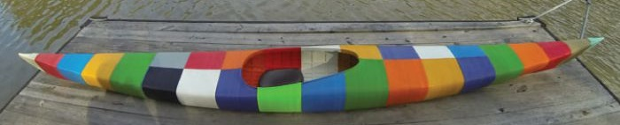

# mold manufacture solutions

## 5 meter below size solution

3D MODEL DESCRIPTION
Completely 3D printed Kayak! The Kayak measures 16ft 8in [5.08m] long. All of the 28 Structural Parts are 3D printed, secured together with M5 machine screws & brass threaded inserts and then sealed to each other with a little bit of silicone caulk. That’s it. And it floats. Moves really fast through the water!

This creation includes the Complete Detailed Kayak Source CAD Model, Add-Ons, STLs and Detailed Bill of Materials with Sources!

Full detailed CAD models and CAD model assembly: You can modify the source design files as needed for your application or optimize performance for your size & weight. The overall assembly is provided in these formats: Solidworks 2015 (native), Pro/Engineer, Parasolid, IGES, STEP and eDrawings. Also, all the 3D printed parts are provided in STL format.

Over the years, I have a made a number of Add-On parts for the Kayak: A GoPro holder for the Bow, A Flag holder for the Stern, Perfectly fitted 3D Printed Car Rack mounts for the kayak, A fitted stand system using low cost speaker stands so you can work on or display the kayak. All Add-Ons are included in the CAD assembly.

All parts are listed with required quantities and source vendors. Vendor part numbers and prices are provided for all stock parts for rapid sourcing.

[All other info and video of the kayak in action can be found here:](http://www.grassrootsengineering.com/)

[Looking for just the Kayak STLs? See this other creation:](https://cults3d.com/en/3d-model/various/world-s-first-3d-printed-kayak-stls-only)

3D PRINTING SETTINGS
The Kayak is comprised of 28, 3D printed sections. Each section has M5 brass threaded thermoplastic inserts so the next corresponding section can be screwed into it with M5x20mm machine screws. Silicone caulk is only used between the sections to ensure it is watertight. This design is heavily modified for 3D printing and requires no supports. To reduce print time and material usage, the kayak can be successfully printed at a 0.65mm layer height, cut you can use any layer height desired. It features a 6mm thick hull with a built-in, internal rib/support structure to give it strength, yet be lightweight and use less plastic. Any print material can be used. On the bow and stern of the Kayak I added attach points for cameras, handles and future add-ons.

[reference:](https://cults3d.com/en/3d-model/various/world-s-first-3d-printed-kayak-stls-only)

## 5 meter above size solution
