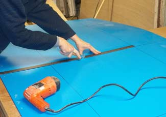
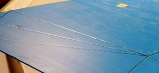
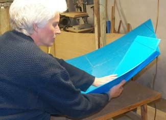
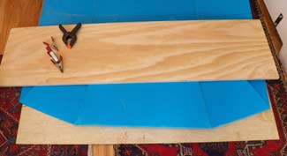
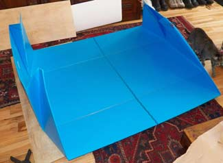

# Scoring and folding the Boat

PART 1: The boat and making a model What am I building?

PART 2: Transfering the design Onto the Coroplast

This Page is PART 3: Folding the coroplast sheet

PART 4: Bracing, Making Floor, and Stiffening the Boat

PART 5: Finishing and Launching

coroplast boat

I pre-scored the coroplast using a heat gun (carefully because it can melt the plastic), and using a dull wheel I had to repair window screening.

heat gun and wheel scoring toolcloseup of scores

Left photo shows the little wheel I'm using as well as the heat gun. It has a wide wheel and a narrower one. Both are dull and don't cut. I'm using the wider wheel. The heat gun is sold to strip paint I think. One of the tools I sort of inherited and never used for its original purpose. On the right you can see the score lines. They are slightly indented.

Folding coroplast boat

folding the boat was tricky but not impossible. I had a rigid board and I gradually just worked the seams till they were correctly folding. I re scored a couple of spots and I had one bad fold where the sheet ran diagonally to the little channels.

I wish I had a huge workshop with miles of tabletops. It is still snowing (April 11!!!) and too cold to work outside or in the garage.

I think a second set of hands would have been useful but eventually I got the 4 corners folded.

coroplast boat is clamped together

Well here it is all clamped temporarily. Fold are not bad and it does look like what it should look like. This boat is not very big though!

coroplast boat

On the left is Ken Simpson's the designer's boat. Somehow his boat looks larger.

I am making one modification. Instead of cutting out the corner pieces and taping the edges together, I am folding in the extra material so I do not have to cut. I prefer the safety factor this provides. IF the tape lets go then the boat still stays together. The tape is very strong though, so I think I'm just being a scaredy cat.

coroplast boat bow detail

I'm back in the living room, much more civilized. This is the bow folded flat. One of my folds was slightly off but a wide heavy board flattened everything well. Both the bow and stern fold down quite flat now.

coroplast boat half folded

The line in the centre is the middle fold. The bow and stern fold in, then the the middle fold closes the package. It looks like the folded up boat will be about 3 or 4 inches thick.

On to coroplast boat stiffeners, bracing and other finishing touches.

PART 1: The boat and making a model What am I building?

PART 2: Transfering the design Onto the Coroplast

This page PART 3: Folding the coroplast sheet

PART 4: Bracing, Making Floor, and Stiffening the Boat

PART 5: Finishing and Launching while the peanut gallery looks on.

HomeMy BoatsBoatbuilding Links & Resources from my WebsiteBuilding a ScampParacord and Projects
I try to be accurate and check my information, but mistakes happen. If you decide to build a coroplast boat remember its an experimental boat and you need to use it in safe water. Wear your PDF and have fun.

email me if you find mistakes, I'll fix them and we'll all benefit: Christine
