# Bracing, Making Floor, and Stiffening the Boat

PART 1: The boat and making a model What am I building?

PART 2: Transfering the design Onto the Coroplast

PART 3: Folding the coroplast sheet

This Page is PART 4: Bracing, Making Floor, and Stiffening the Boat

PART 5: Finishing and Launching

After marking and folding the plastic sheet and checking that everything will fold up tidily, I'm now ready to add some structure. The designer has chosen to do this by adding thwarts, a floor and some bracing.

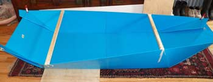

There are 2 thwarts which get bolted in when the boat is to be used. They are not the same length, the bow thwart is narrower than the stern. Here I have taped them in to check that they fit. Ken Simpson suggests 1x2 but I was cutting down a 2x4 so my thwarts are slightly thicker and not so wide.

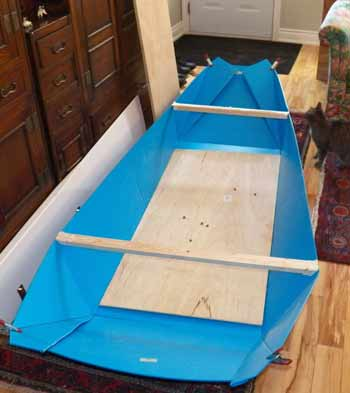

Seen from the back the bow is narrower than the stern. The floor gets a plywood piece to help reinforce it.

Ken Simpson suggests 3/8 thick but I have a sheet 1/4 that I will try. It's not perfect but I have it and I want to use it. I think I can add a small reinforcing lath along the length to help strengthen it. (Note: 1/4 was not thick enough particularly since it was not a high quality ply in the first place. Use 3/8 if you can.)

I boiled a sample of the plywood to check for water damage and it has survived with no problems.

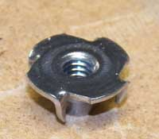

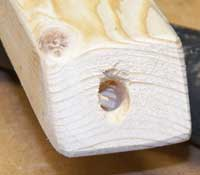

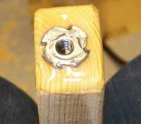

T nut used in thwartcloseup of holeT-nut epoxied in hole
Close up of the T nut used to attach the thwart to the boat. The thwart gets a hole and the t-nut is tapped in. I've covered everything in epoxy. I'm using cheap 5 minute epoxy from the dollar store.

This allows the bolt to be tightened into end grain and removed countless times.

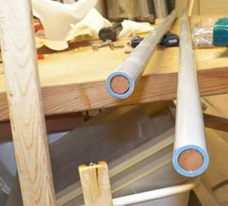

Plastic electrical conduit is used to brace the side edge. I had a dowel which works very well to reinforce the ends where the conduit gets drilled though and bolted onto the end of the thwarts and through the hull. The dowel keeps the conduit from being crushed when the nut is tightened. I expect that since it is plugged at both ends it will float too.

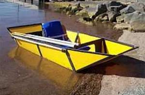

On the Boat that Ken Built you can clearly see the conduit along about 4 feet on the side of the boat. Without some stiffening the sides would be too floppy.

I think wood slats could be used instead of conduit.

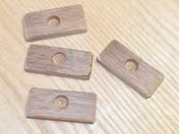

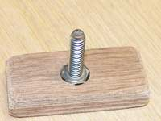  in handleHandles and bolt in thwart

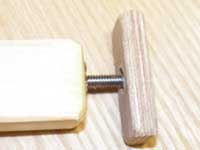

4 handles are made of wood with an indentation drilled in. The bolt gets epoxied into the handle and this makes it easier to turn. The photo on the right is the bolt attached to its handle screwed into the end of the thwart. This will hold the reinforcing conduit attached to the boat and also bolt the thwart in place.

All the woodden parts will be painted and sealed.

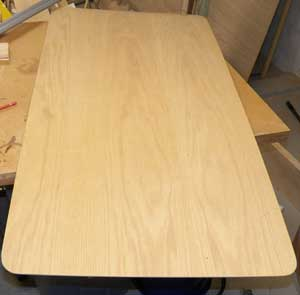

A quarter sheet of plywood gets sanded and corners rounded. This will be the floor. Since I am using a quarter inch thick plastic sheet it is not very rigid and cannot support a person without buckling. The plywood distributes the weight on the whole boat floor. This is good quality ply with 5 plies and it is quite stiff. I will have to be careful when I step in not to damage it.

When the boat is folded, the plywood floor fits inside the folded sides. The folded boat is 2 feet x 4 and about 4 inches thick.

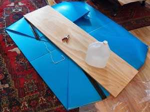

testing the foldseam stiffening

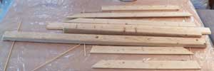

After starting to tape the various parts together I tested the fold to make sure it went down as flat as possible. It's almost miraculous to see the boat fold up flat.

Several strips of thin wood add some stiffness to the bow and transom. They are thin strips of the same 2x4 I cut to make the thwarts. Everything gets a coat of varnish then the strips get taped in the seams. I added a bit of PL premium. I know it is not a great glue for coroplast but I would be satisfied with a weak bond supplemented with the tape. The strips are thinner than 1/4 inch and weight very little.

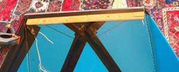
stiffening strips taped inassembled boat close up of stiffening

I drilled the side supports made from conduit and screwed then on using the bolts with handles prepared earlier. The boat goes together well but is a bit floppy yet. At this point If I place the floor in the bottom I would not have any trouble floating and paddling around. It's still way too cold to try though!

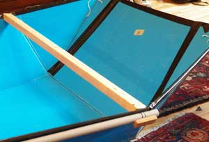

Only one more piece needs to be added. There are little pieces of coroplast that get attached to the thwart and help keep the sides from moving. This is next. Ken Simpson showed his boat with attractive cloth cowlings fore and aft and I might put this together as well.

PART 1: The boat and making a model What am I building?

PART 2: Transfering the design Onto the Coroplast

PART 3: Folding the coroplast sheet

This page is PART 4: Bracing, Making Floor, and Stiffening the Boat

PART 5: Finishing and Launching while the peanut gallery looks on.

I try to be accurate and check my information, but mistakes happen. If you decide to build a coroplast boat remember its an experimental boat and you need to use it in safe water. Wear your PDF and have fun.

email me if you find mistakes, I'll fix them and we'll all benefit: Christine

https://www.christinedemerchant.com/boat-building-coroplast3.html
