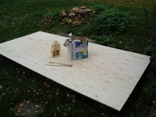
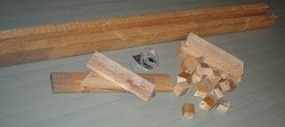

# "Simbo", the simple boat

As simple as it can get

This is an easy start for boatbuilding. A very simple 7'4" x 2'8" boat, made out of simple materials, using a simple construction method and just the basic tools.

The design displacement is 230 lbs, that is, one person. The boat displaces about 900 lbs just before swamping, so there is room for more cargo at the cost of speed. But speed can't be the reason for building a boat like this :-)

Here is the .hul file for those interested.

## Material and tools needed
	
### Material for the hull:

* One sheet of 12 mm (1/2") spruce or other light weight plywood.
* A couple of left over strips of plywood to be used as butt blocks.
* Epoxy resin.
* Epoxy filler (commercial filler, saw dust, wheat flour or garden chalk powder).
* 50' of glass tape (not showing here). Drywall tape will do in a small boat like this.

"12 mm, that's thick and heavy! All other small boats are built out of 6.5 mm (1/4") ply. Why not this one?" I hear You ask.

12 mm ply is stiff enough to be used without any extra wooden beefing strips here and there. So weightwise it comes about equal. But constructionswise much simpler and quicker. This is a simple boat, remember. That's why!

But remember also, that many small boats cannot be built out of 1/2" ply. 1/2" ply is stiff, so it will not bend to tighter curves required on some boats.

You can, of course, build "Simbo" out of 1/4" ply. But in that case she will definitely need some stiffening around all the edges. A 1" x 1.5" pine strip glued to the outside of sides and transoms will be fine.

### Material for a jig:

* Two lenghts of 2x4. 2 m (7 ft) is long enough, if You have longer lengths, don't cut unnecessarily, extra length doesn't hurt.
* A couple of brick size blocks of 2x4.
* A couple of pieces of plank, about 20-25 mm (1") thick.
* 22 pieces of 2x2, about 2" in length. Split pieces of 2x4 are fine.
* Drywall screws, or other thin screws, roughly 35 mm (1.5") in length.
* Two slightly longer screws, maybe 65 mm (2.5").

None of these sizes are critical.

"Do I need to build a jig? That's not simple!" I hear You ask.

I've been quilty for the same mistake over and over again. Trying to assemble something in the quick and dirty way. Trying and trying to avoid building anything that seems "extra", but that would help doing the job properly and in no time. Lesson learnt: Build the jig. This is a simple jig, building it only takes a minute.

### Tools:

* A hand saw.
* A screwdriver (battery powered drill in this case, but a manual one will do, barely).
* A measuring tape (Buy one with both metric and imperial measures, life will be so much easier. You'll never do any more conversions.).
* A pencil.
* Duct tape.
* A batten (thin strip of wood) about 2.5 m (8") in lenght.
* Sand paper (a belt sander in this case).
* Small paint brushes for smearing epoxy.
* Epoxy mixing container (a flat one).
* Paint.
* Paint brushes.
* Mixing sticks.

That's all, lets get to work!

## Building "Simbo"
	
Mark and cut a 8" slice from one end of the plywood sheet.

	
Mark and cut the "Simbo" transoms out of the slice. The measurements from the edges are 2" - 21 " - 25". Don't do like I do: mark with a felt pen. I only do so to show the marks clearly on the photographs (and they don't show clearly :-(
Instead, use as faint pencil marks as possible. You don't want them to show through the paint. Save the two "waste" triangles for later use.

	
Mark both ends of the remaining plywood at 13.5" - 21" - 13.5".
Mark the middle points of the long sides (44" - 44").

	
Mark the transom end height at the middle of one edge (one edge is enough) of the ply.

	
Connect the points with straight lines.

	
Temporarily attach three drywall screws to the ply. Two at the outer ends of the lines, one in the middle. In such a way, that the distance from the batten tensioned between the screws to the intersection of the lines is 1".

	
Draw a curve along the batten, not crossing the straight line at any point.

	
Saw along the curve. A regular hand saw is fine in this, much better than an electric jig saw. A hand saw is faster and gives a smoother curve.

Flip the sawn out side over the uncut edge of the ply. Draw a line along the cut curve, saw along the line.

	
You now have the "Simbo" bottom ready. Cut the sides in the middle...

	
...and rearrange the parts.

	
Using the bottom as a form, draw the same curvature as the bottom sides have to the side pieces, trying to minimise waste. Save the "waste" for later use.

	
Cut the side pieces to the correct curvature.

	
Screw 18 pieces of 2x2x2 blocks to the very edge of the bottom, at about 1' intervals, from the underside.

	
It makes sense to assemble the jig at this point. The bottom will be out of the way and will get some pre stressing towards the final bend.
So lay the lenghts of 2x4 parallel, about one foot apart, lay the bottom piece on top of them, and attach the middle of the bottom piece to the lengths of 2x4 using the two long screws and a piece of plank as a "washer".

	
Bend the ends of the bottom up with two blocks of 2x4.

	
Screw the remaining 2x2x2 blocks to upper corners of both transoms.

	
Screw the transoms to the blocks in the ends of the bottom.

	
Join the side pieces using butt blocks. The blocks should be roughly 4" wide, and the height of the side. Cover the outer side of the seam with duct tape or plastic. Screw temporarily against a piece of plank.

Glue pieces of ply 12" from the seam for rowlock attachment, if You are going to row the boat.

	
Screw the sides first to the upper transom corner blocks in one end of the boat.

And then to the upper transom corner blocks in the other end.

	
Then proceed along the sides, alternating from side to side, one screw at the time. If You do one full side in a go You may end up with an asymmetric hull.

If the bottom curvature seems incorrect at some spot, wedge it using pieces of plank between the 2x4 jig and the bottom ply.

If You didn't have the jig You'd be bending the bottom and both sides, all at the same time now. I think You'd despair.

	
In case the day shines through the seam somewhere, seal the seam with duct tape. You will soon glue the seam from the outside, and You don't want the glue to run to the inside.

	
This is the principle of the seam.

The bottom and side (yellow) held together with blocks and drywall screws.
The seam between the plies filled with thickened epoxy (red).
The seam covered with glass tape and epoxy (green).
	
Turn the boat over. Wet the seams using a small paint brush and unthickened epoxy.

Then fill the seams using thickened epoxy (peanut butter consistency).

Cover the seams with glass tape and wet the tape with unthickened epoxy.

But don't cover the screw heads with epoxy. You'll remove the screws later, that's a lot easier without epoxy on them ;-)

That's it for today. Less than three hours of effective working time used and she begins to look like a boat.

You can't go on before the epoxy is hard. Better not rush it, so wait at least until the next day.

	
What was the slim "waste" from side and bottom curvature used for, by the way?

To light fire in my sauna stove :-)

The next day.

	
Remove the temporary screws.

Turn the boat over, remove the 2x2x2 blocks, possible duct tape, butt block holding screws, jig screws, jig.

Sand the boat. Round the edges.

Fill all screw holes with thickened epoxy.

Glue the "waste triangles" from transoms to opposite corners of the hull to stiffen the boat. (If You have some waste pieces of plywood, it wouldn't hurt to have better stiffeners in all of the corners.)

Wet the inner seams with unthickened epoxy, then apply a bead of thickened epoxy to them. And glass tape, like on the outside.

	
Now the seam should look like this:

The blocks and the screws have been removed.
Thickened epoxy bead on the inside (brown).
Covered with glass tape and epoxy (blue).
The boat ready, but without paint, in less than five hours of effective working time.

Depending on whether You are going to paint the hull, let the epoxy cure. I'm going to treat the hull with linseed oil, so I just go on with two coats of oil.

This is not an everlasting solution, however. UV-radiation will spoil unprotected epoxy, so paint Your boat. I will, too, once I have tried her out. Or, on second thought, it might be a good idea to experiment here as well. How well does linseed oil protect plywood, especially the upper edges?

Simbo resistance curves at 105 kg / 230 lbs total displacement
	
Rt (violet curve) = total resistance
Rv (red curve) = viscous resistance (friction)
Rw (blue curve) = wave forming resistance
Rh (pale blue curve) = resistance created by transom stern
Full speed scale = 4.0 m/s = 14.4 km/h = 9.0 mph = 7.8 knots

Top of the page.
Back to main page.
Simbo Mk II

The looks of "Simbo" can be improved, with no additional trouble. Just build the ends slightly slanted. The bow transom slanting out, stern transom in. The only thing You have to do differently is to cut the side pieces in two, not with a straight cut, but with an inclined cut. That's all.

Here finally a slightly more formal presentation of how to cut "Simbo" parts out of a plywood sheet.

The black measurements are the ones You measure for actual measurements of "Simbo" parts. The blue measurements are the ones You measure to centralise things. That is, they have to be equal in pairs. And finally, the red measurements are the ones You measure with the transom ends.

The black lines are the ones You cut. The red lines are auxiliary lines, You draw the actual edges of the bottom using a batten, like shown above.

And the same in metric.

Here's the slanted end.hul file.

Top of the page.
Back to main page.
Maiden voyage
	
Why am I kneeling, not sitting? Well... this is a "luxury version" of the "Simbo". A couple of beautiful fountains on the inside to entertain passengers...

Lesson learned: fill ALL screw holes.

But on the other hand, this also shows, that she is not tippy. If she were, I'd swim by now.

	
This is how much "Simbo" tolerates 200 lbs weight shift.

	
The "Hulls" modelling works: the transoms just touch water. In other words, the initial freeboard is about 8".

A very nice little boat, considering the price and effort!

Now I know she works fine. So I can go and paint her.

http://hvartial.kapsi.fi/simbo/simbo.htm
