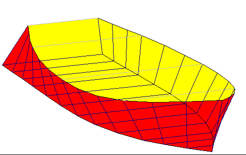
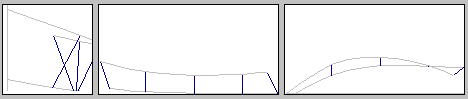
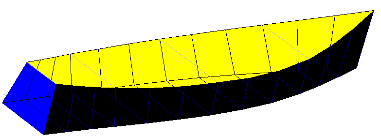
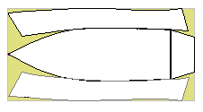

# One Sheet Runabout, "Sled"

I'm just waiting for the day when I become a grandfather. From that day on I will have a good reason to build things like this.

"Sled" .hul file.
Definitely not for paddling nor sculling, this boat has to run fast.

I can imagine myself pulling small kids, screaming for more speed, in a "Sled" behind a powerboat, their parents horrified on the beach ;-]

"Sled" hand plotting text file.

Plot the bottom, sides and transom on a sheet of plywood according to the hand plotting file above, You should get something like this.

If my kids see this, I'll never have grandchildren ;-)

http://hvartial.kapsi.fi/oss4/sled.htm

Top of the page.
Back to main page.
