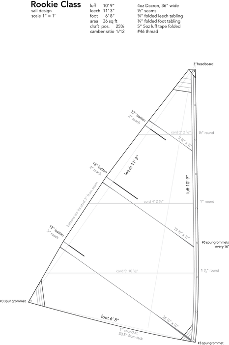
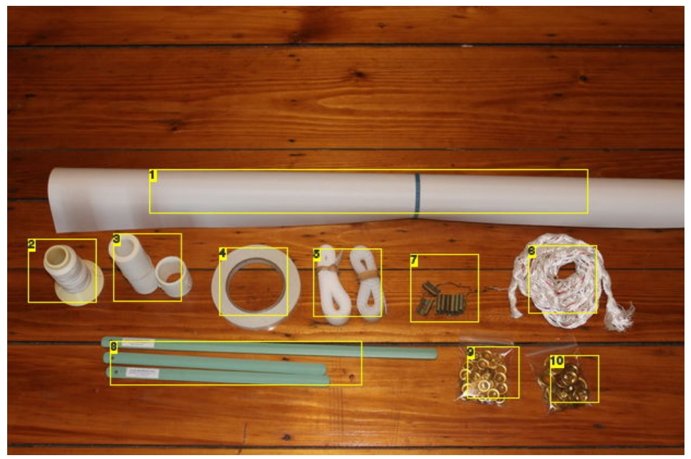
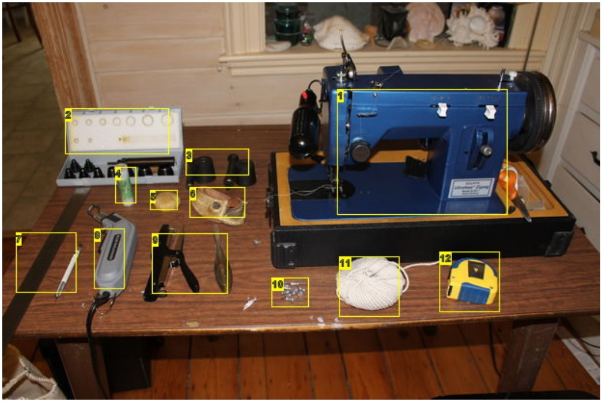
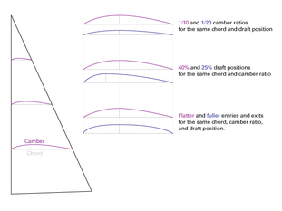

Make a Dacron Sail
Modified by deligeer May 18, 2022
by plasticvicar on June 2, 2012

# Intro: Make a Dacron Sail
There are several excellent Instructables about making sails from poly tarps and traditional cotton, but so far none for Dacron. Well, time to fix that!

In this Instructable, I will be making a sail for a Buzzards Bay Rookie, a small one-class sailing dinghy that was popular in Southeast Massachusetts about a hundred years ago. The Rookie fleets were eventually replaced by Optis in the '50s or '60s, but you can still find a Rookie hull here and there. We restored one at the Woods Hole Historical Museum this winter, and I made the following sail for it.

You may be wondering why I would make a modern Dacron sail for a 100 year old boat. Good question. The builder of our boat, Oscar Perry, was famous for boasting that he could build a Rookie in a single day. Given this attitude, do you think Mr. Perry would have used Dacron cloth, seamstick, and luff tapes if they were available to him? Of course he would have! So, although this sail is not period in terms materials, it is most definitely fitting in with the spirit of the original.

# Step 1: Tools, Materials, and Resources

Materials needed to build the Rookie sail:

* 7 yards of 3.8oz [Dacron](./fabricDacron.md)
* 4 yards of 5-6" wide, 5-6oz Dacron tape
* 5 yards of 2" wide, 3.8oz Dacron tape
* 1/2" wide Seamstick double-sided tape
* 46 thread, #14 and #16 needles
* 6" of 1" wide velcro
* 3"x4" headboard
* x7 #0 spur grommets
* x2 #3 spur grommets
* x8 sail slides
* x2 12"x5/8" battens
* x1 18"x5/8" batten
* Heavy polyester twine for seizings and handsewing (I make this by breaking down 1/2" polyester three-strand line)
 
Tools needed:

 Sewing machine
 Hotknife
 Stapler and staple remover
 Tape measure and a long metal ruler
 Mechanical Pencil
 String
 Sailmaker's needles for handsewing and seizing
 Chunk of beeswax for handsewing and seizing
 Sewing palm for handsewing and seizing
 Hole cutters for #0 and #3 spur grommets
 Setting dies for #0 and #3 spur grommets

You will also need enough space to lay the sail out full-size...preferably on a floor that you can stick thumbtacks into.
As we go along through the steps, I will explain what each of the tools are used for, and possible alternatives.
All of the tools and materials listed here can be purchased from:

* Sailrite
* Duckworks
* Jamestown
* Challenge (By far the cheapest, but you need a tax id)
* [Fabric Dacron](./fabric-dacron-supplier.md)
 

For more information on sailmaking, I recommend The Sailmaker's Apprentice by Emiliano Marino and Make Your Own Mainsails by James Lowell Grant. Both of these books are available on Amazon and Sailrite.

Image Notes

1. Dacron
2. #46 thread
3. Dacron tape for luff and batten pockets
4. The all-important double-sided tape
5. Vecro (you only need about 6")
6. 1/2" polyester 3 strand line, that I use to make cheap, durable seizing and
handsewing twine
7. Sail track slides
8. Battens
9. #0 spur grommets
10. #3 spur grommets

Image Notes
1. Sewing machine
2. Hole cutter set
3. Grommet setting dies
4. Handsewing needles
5. Beeswax
6. Sewing palm
7. Ruler and pencil
8. Hotknife
9. Staple and staple remover
10. Thumbtacks
11. String
12. Tape measure

# Step 2: Design the Sail
Most of the time when a sailboat is drawn, its sailplan is included with the drawings. A sailplan is a 2-dimensional representation of the sail, which defines its rig type, size, shape, and area in general terms. The sailplan gives enough detail for the boat designer to calculate the power of the sails and make sure the center of effort of those sails cooperate nicely with the hull, resulting in a balanced and well sailing boat.

The sailplan does not provide enough detail to make a good sail, however, because the sailplan only deals with a 2-dimensional outline. In most cases sails are not 2-
dimensional with straight edges, but have a 3-D shape to them. Sail design is a two-step process of process of taking the 2-dimensional sailplan, determining the 3-
dimensional shape of the sail, and then figuring out how to make that 3-D shape a reality within the constraints of the materials at hand.
To determine the shape, there are several related considerations described below. Please see the image for illustrations of each of these terms, which will probably make a lot more sense than text alone!

Sails are airfoils, and have a cross-sectional curve to them called camber (or draft). The amount of camber in a given sail is often expressed as a ratio, unsurprisingly called the camber ratio, which is a ratio of the chord to the amount of camber. A sail with a high camber ratio results in a big, deep camber that provides lots of power in light winds but sacrifices windward performance; a sail with a small camber ratio results in a flatter sail with better performancein high winds and high speeds, but is not as good for light air. For the Rookie, I chose a fairly high camber ratio of 1/12 as I figured this little boat will mostly be sailed in light winds, and I figured it probably wouldn't go to windward very well no matter how you slice it. If I ever make a second Rookie sail, I might try shaping it with less camber.

Regardless of the camber ratio, you can place the deepest part of the camber, called the draft position, anywhere you like, although different the rig types will require different draft positions. 40% back from the leading edge is a good start for a bermuda mainsail with a jib. Since the Rookie is cat-rigged with no jib, and knowing that the draft of a fuller sail tends to blow backwards, I moved the draft position farther forward to 25% behind the leading edge.

Within a given camber ratio and draft position, it is also possible to have different entry and exit curves, which work as sort of mini-versions of the camber ratio. The entry fullness will affect your sheeting angle, but this is getting too technical for me, so I just went with something that looked moderate and called it a day.

Okay, so now that we have our desired shape, how do we make it with sailcloth? There are three basic ways to impart the 3-D shape into the cloth, which are often used in conjunction:

Method 1, Edge curves. This is primarily a means of inducing the desired camber ratio into the cloth. If a cloth edge is attached to a straight spar (like a mast or boom), then by curving the edge of the sail, draft can be pushed into or pulled out of the cloth in a desired location. This works great with soft cloths like cotton, and can be done in moderation with firm cloths like Dacron. This technique is almost almost always used on luffs and foots. To determine the edge curve of a luff, first divide it into quarters. At each quarter-point, measure the chord of the sail, then enter this measurement and desired camber ratio into formulae found in sailmaking books (see References section) to determine the amount of edge curve at that point. Chances are, these quarter points will not connect together in a fair curve; you'll want to play around with them until they do.

Method 2, Broadseaming. This is primarily a means of setting the draft position and entry/exit fullness in the sail. It is the process of gradually increasing the seam width to impart a curved shape into the cloth in a specific place, not unlike putting darts into a shirt or dress. On a crosscut triangular sail like the Rookie's, these can be used to great effect, particularly on the tack seam which can be used to tailor a lot of draft into this powerful part of the sail. The first step is to mark the draft position at each of the luff quarter points found in the previous step. Then, as before, tweak them until you can connect them with a nice fair line, and mark their intersection with the seams.
Measure the length of the seam from the luff to the draft position, and enter that distance into a magical formula found in sailmaking books (see References) to find the amount of broadening that seam will require.

Method 3, cloth orientation. This is a method of sail shaping that we will not be using in this sail, but you still need to be aware of it. Go and get a woven (not knit) piece of fabric, such as a handkerchief. Note how the fibers run 90 degrees to each other. If you pull on the cloth along these axes, you will find that it stretches a bit, but not much. However, if you pull on the bias, 45 degrees to the weave, the cloth will stretch like crazy! This is something that must be considered, especially when working with soft cloth like cotton, and even when working with stabilized cloth like Dacron. In some rigs, such as spritsails, this stretchiness is utilized to produce camber. In the Rookie's triangular sail, we will purposefully mitigate this tendency to not induce curve in our sail. We will do this by aligning the cloth perpendicular the leech of the sail.

This makes the leech very resistant to stretching, which is good, but puts the bias of the cloth along the luff! Not good! To prevent the luff from stretching, we will sew four thicknesses of Dacron tape to it, which will give us the stretch resistance that we need.

Other things that should be on your sail plan:

* Headboard, drawn to scale if possible
* Number and size of corner patches
* Size of grommets
* Number, size, and location of battens
* Cloth and thread specifications
* Size of seams and tablings

One more tip: Dacron sail designs are always drawing starboard side up for good luck. Nothing will mark as a noob faster than drawing a sail port-side up!

Finally, once you've drawn up your sail design, with edge curves and broadseams, take it to a real sailmaker for review if possible. Chances are, after learning about edge curving and broadseaming, you will go nuts and overdo it. A professional sailmaker will be able to offer you direction and suggestions just by glancing at your drawing, utilizing their many years of experience. This is definitely worth doing if the option is available to you.

# Step 3: Loft the Perimeter
Lofting is simply the process of drawing something full-size. The key requirements for a lofting area include:
enough space for the sail, plus room to lay out the cloth, plus any lofting battens that you'll use to draw curves
a floor that you can push pins into
cleanliness and good lighting
This is a small little sail, so for convenience I lofted it in my living room. I discovered too late that my living room didn't have enough room for lofting battens, but I found a
way around that.
Modern Dacron sails are constructed starboard-side-up for good luck, but due to my furniture layout I had to do mine port-side up at this stage. (I still sewed the corner
patches, tablings, and batten pockets to the starboard side though).
The first step is to draw the straight-line perimeter, by pushing pins into the floor at each of the sail's corners. If your floor has visible planks like mine does, it's helpful to
align the leech with the seams in the floor, because you'll be rolling cloth out relative to the leech. That being said, I didn't have room to do that, so I aligned my luff to one
of the seams. Better than nothing!
I took the measurements of the straight-line luff, leech, and foot from the drawing, and made corresponding lengths of string with loops on each end to exactly the same
dimensions. I used some old non-stretch spectra kite line; the key is the non-stretch part. After I made the lengths, I pushed a pin into the floor representing the tack
corner, then used the corresponding kite lines to locate the head and clew pins. In the photos, this line is pink.
Next, I wrapped the perimeter with some stretchy cotton twine, so that there were two strings going around...non-stretch pink kite string representing the straight-line
dimensions, and stretch cotton twine that will soon receive the edge curve dimensions.
Now use the cotton twine and more pins for the headboard, roach, foot curve location, and luff curve locations according to the sail design.
Finally, you need to pin a string to represent the tack seam. This line goes from the tack to the leech, and strikes the straight-line leech at exactly 90 degrees. I used a
framing square against the straight-line leech string to find this location. This line is important! The cloth is laid out 90 degrees to the leech because the fabric does not
stretch (much) along that axis, and thus keeping the leech tight under load. (Cloth orientation, stretch and its effects are important in sailmaking. For more information on
cloth stretchiness along the warp, weft and bias, refer to The Sailmaker's Apprentice by Emiliano Marino.)
Because I wasn't going to be able to finish the sail in one evening, and I didn't want to stub my toe on a pin if I got up in the middle of the night, I went around the cotton
twine with masking tape, being sure to annotate points of interest such as the roach and edge round locations.
Image Notes
1. Tack
2. Leech
3. Luff
4. Foot
5. Clew
6. Head
Image Notes
1. Headboard
2. Straight-line head, but not the actual head of the sail
3. Thin pink string represents the straight-line leech
4. Luff
5. Leech
Image Notes
1. Thin pink line represents the straight-line leech
2. Pin at roach location 1
3. Pin at roach location 2
4. Pin at roach location 3
5. White cotton cord represents actual perimeter of the sail
Image Notes
1. Framing square against thin pink straight-line leech to determine the tack seam
2. Tack
3. String represents the tack seam
Image Notes
1. Head
2. Roach Point
3. Roach Point
4. Foot round location
5. Luff round location
6. Luff round location
7. Luff round location
# Step 4: Roll Out the Cloth
With all the lofting done, it's time to roll out the cloth!
Start at the tack seam, rolling the cloth from the leech to the luff. Stick a few pins in the cloth to keep it in place. Give yourself enough allowance on each edge for tablings
and the cloth shifting around after you broadseam (next step); I left myself about 4" on each side. Now cut!
Next, stick a piece of double-sided tape along the top edge of the fabric. I am using 1/2" seam allowances on this sail, so I bought 1/2" wide seamstick. That way, I didn't
have to measure, I just had to make sure my cloth edges were aligned with the edges of the tape.
Do not pull the backing off the tape yet!
Now turn your cloth roll 180 degrees and roll it back towards the leech, working your way up towards the head. Make sure the edge of the fabric lines up with the edge of
the tape, giving you your 1/2" seam allowance. Pin it out as you go along, cut it, and put another strip of double-sided tape along its top edge, but again do not pull off the
backing tape yet.
Rotate the roll 180 degrees, roll it towards the luff, and continue working back and forth in this manner until you have seamed all the way up from the tack seam to the
head.
Once you've gotten all the way up to the head, go back to the tack seam and work towards the foot. The reason this is done is to accomodate big foot tapers found mostly
in jibs and genoas, but also occasionally in mainsails. In hindsight, I guess we didn't need to do it in two halves on this particular sail.
Anyways, roll the cloth along the tack seam down to the foot, in much the same manner as before, but this time put the seamstick on the new fabric being rolled out, and
slide it under the existing cloths, to keep the seam overlaps going in the same direction.
http://www.instructables.com/id/Make-a-Dacron-Sail/
Image Notes
1. Double-sided seamstick tape
http://www.instructables.com/id/Make-a-Dacron-Sail/
Step 5: Annotate Points of Interest
With the cloth all laid and pinned out, it's time to mark the important points on our sail
These include:
Head
Tack
Clew
Roach points
Foot round point(s)
Luff curve points
Where each seam strikes the perimeter of the sail
The location on each seam where a broadseam starts
I use a mechanical pencil to make these marks. It's probably a good idea to make a little annotation along with the mark.
http://www.instructables.com/id/Make-a-Dacron-Sail/
Image Notes
1. Roach Point
2. Where seam strikes the leech
# Step 6: Sticky-Tape All Straight Seams
On the Rookie sail, all the seams are broadened to a greater or lesser extent, both at the luff and the leech. However, each seam also has a portion in the middle of the
sail that is straight—a consistent 1/2" wide seam. At this point, stick these straight portions with the double stick tape.
Because you annotated the location of the broadseams in the previous step, you know where each straight portion is. Stick a pin in the seam outside either end of the
straight portion, to keep things from shifting around as you work. Lift up the cloth in the middle, peel the backing off the sticky tape under the straight section only, and
smooth the cloth down onto it.
Give the seam a good rub-down to make sure it's stuck. I have a little seam-rubbing tool that I made, but you can also use a socket-which is heavy, smooth and round—or
the back of a wooden spoon.
Image Notes
1. End of the leech broadseam
2. End of the luff broadseam
# Step 7: Draw The Broadseams
The seam widths on a sail are broadened to impart a curved shape to the sail. Refer to your sail design to determine the locations and amount of the broadseaming.
Leech broadseams are usually minuscule and straight, giving just a tiny bit of tension on the leech to prevent it from fluttering. You might as well get those out of the way
first, since they're so easy. On the Rookie sail, I broadened the leech seams by like 1/16". At the seam-leech intersection, measure out 1/16" from the existing seam, take
a straight edge, and draw a straight line to the broadseam-start location that you annotated earlier.
Luff broadseams, particularly the tack seam, are neither minuscule nor straight, imparting much shape into the sail. For these, you don't want to use a straight edge to
draw the line, you need to bend a flexible batten to create a nice fair curve. I couldn't be fussed to go down to the shop and get a proper batten, so I used a little wooden
dowel that I had lying around. Traditionally battens are wood, but anything that's straight, springy, and easily bends into nice, even curves will work.
First, we'll do the tack seam. That's the biggest one, the most important to get right, and the one that sets the tone for the other seams heading up the luff.
Refer to your sail design, and mark the location of the broadseam at the seam-luff intersection. Stick a pin at the beginning of the broadseam, and another pin where it
will intersect with the luff. Place the batten on the outside of these pins, and slowly bend it towards the existing seam, until you end up with a nice curve that smoothly
transitions into the existing seam in the middle of the sail. Pin it!
There is an art to making these bends. A more radically-bent batten will produce a sail with a "fuller entry." A straighter batten will produce a "flatter entry." Sails with fuller
entries can produce more power in lighter winds, while a flatter entry is more appropriate in higher winds. But remember, this is a tiny sail on a tiny boat with tiny seams.
http://www.instructables.com/id/Make-a-Dacron-Sail/
It's probably not worth stressing out over. I made mine kinda fullish, since I don't anticipate anyone sailing an 8' Rookie in Force 5 winds.
Run your mechanical pencil along the batten, then remove the batten and pins. Go to the next seam up the luff, measure, mark, and pin. Although this broadseam will be
smaller than the tack broadseam, you will want the batten's curve to be compatible with the tack's. In other words, you don't want a radically-bent batten in the tack seam,
and a straight one on the next. Although the broadseam is smaller, feel the bendiness of the batten, and try to make a similar curve to the previous one.
And so on up the luff.
For the Rookie sail, we only have three seams, and only two of them have broadseams of any consequence, so this is a pretty easy job! It would be a tricky thing to get
consistent on a big sail with lots of seams, however.
Image Notes
1. Little smidge of a broadseam on the leech
2. Leech broadseams are straight. No need to bend battens here
Image Notes
1. Tack broadseam, with a wooden dowel for a batten.
# Step 8: Tape the Seams
Remove all pins from the sail!
Let's start with the leech broadseams again. They're easy, so you can get the hang of it before moving on to the bigger ones on the luff.
You removed all the pins, right? Good.
Lift the cloth, remove the backing from the tape, and working from the starting point of the broadseam, slowly make your way towards the leech, gently curving and
sticking the cloth together along the drawn line. The cloth will not particularly want to do this while laying flat on the floor, so you may have to shake or fan the cloth a bit
first. The key is to make sure your seam is stuck evenly along the drawn line, and there are no bubbles between the tape and the cloth indicating a misalignment. When
you're finished, go ahead and put a safety staple just outside the leech, to ensure that the seam doesn't start to peel apart.
Once you've done the leech, go for the tack seam, then work your way up the luff.
Now look at that! your sail doesn't lay flat on the floor anymore!
Take this opportunity to rustle up two helpers and do a "hang check." With each of you at a corner, lift the sail off the floor and put a little tension on it. This will allow you
to see the shape, and in particular any bubbles, wrinkles, or unevenness in the (broad)seams. Because you haven't sewn anything yet, you can unstick the offending
portion and change it!
http://www.instructables.com/id/Make-a-Dacron-Sail/
# Step 9: Coerce the Sail Back Onto the Drawing
The following step is one that I find frustrating. There must be a better way. Perhaps one of you in the comments can enlighten me.
We need to take our sail back to the drawing. The problem is, it will no longer line up because the sail no longer lies flat, and because its dimensions have changed due
to broadseaming (particularly along the luff). It is most important for the cloths to be running perpendicular to the straight-line leech, so let's get that right and then worry
about everything else.
The first step is to pin the head. Next, pin the clew, keeping in mind that the mark on the cloth will not line up with the one on the floor. Do not force it, and do not stretch
or distort the cloth. Get it as close as you can, while keeping the seams running perpendicular to the leech. You can use the roach annotations that you made previously
to help you get it close; they won't line up with the ones on the floor anymore, but it gives you more points to help you approximate.
Finally, go to the tack, and fan it up and down to get some air under the sail. Let the tack fall naturally, and pin it as close as you can get it without stretching or distorting
the cloth. Use the foot-round marking and the luff curve markings to help you get it as close as you can.
Once you've got it pinned down, erase the clew, tack, roach, and edge curve annotations that you had made previously. They were just to help you line things up during
this step. Mark the new clew and tack positions.
Next, use a clean broom to sweep as much of the excess cloth into the middle of the sail, away from the edges. You won't be able to make it perfect, but you will be able
to make some improvement.
Make sure you scowl and furrow your brow a lot during this process.
# Step 10: Draw the Luff Curve
This is a fun one!
The curve of the luff is an important part of sail design. By making the edge of the luff round, then attaching it to a straight mast, shape can be pushed into the sail. The
amount of round at each point in the sail is determined by Salty Old Sailmaker Magic, or for the rest of us, formulae that take into account the amount of desired shape
and the chord of the sail at that location. These can be found in sailmaking books, such as The Sailmaker's Apprentice.
First, try to get the luff to lay as flat as possible. You can do that by sweeping with a broom towards the middle of the sail while pinning the cloth near the luff once it starts
to flatten out. Another, perhaps better way is to unpin the clew and with the aid of a helper, make an accordion-like fold about 1 foot behind the luff. (Skip ahead to the
section on attaching the luff tape to see what this looks like.) I did not do the accordion-fold method this day, but I probably will if I build another Rookie sail.
If you haven't erased the old luff-round points off the sail, go ahead and do that now (those were just to help you align things in the previous step).
At this point, you would normally take the luff round measurements from the sail design, and mark them on the sail. Then you would use a long batten to bend a great,
majestic, heartbreakingly beautiful curve through those points. That's what I had planned on doing for the Rookie.
Then I discovered that my batten was larger than my living room. Oh no!
So, I came up with Plan B, which you are going to see! Although I can't say it worked better than the wooden batten method, it did work! If don't happen to have any long
battens, you might give this method a whirl.
I had already drawn the sail design to scale in Adobe Illustrator, and had already taken the time in the software to bend a nice, fair bezier curve through the luff round
points. In other words, I had already virtually done the work that would otherwise be done with a batten. So within Illustrator, I measured the distance between the luff
curve and the straight-line luff, every foot along the entire length of the luff.
Good thing I saved my pink straight-line luff string! I pinned that out on to the sail, and placed a tape measure alongside. Every foot, I plotted the leech curve offset that I
had measured in my Illustrator document and marked it with a pencil.
Then I took a length of 2" webbing, and pinned it at the points I plotted. So began a long, arduous process of checking the webbing curve for fairness and tweaking it little
by little. Crouch down. Squint. Take off your glasses. Put on your glasses. Stand on a chair. Nudge the webbing in one spot. Stick in about 70 pins. Repeat.
The entire process easily took 45 minutes, perhaps an hour, but it did work!
Once I got the webbing curved nicely, I ran a single pencil line down it, pulled up the webbing, and moved on to the foot curve.
Image Notes
1. By sighting down the webbing, I can see a spot right there that needs
adjustment
# Step 11: Draw the Foot Curve
This sail is flown loose-footed, meaning it is not attached to the boom except at the tack and clew. Therefore, the foot curve cannot be used to push shape into the sail
like the luff is; the foot curve on this sail is almost entirely cosmetic.
The foot curve is described by only one point, a certain distance back from the tack, and a certain offset from the straight-line foot. Again, I used a broom to sweep as the
foot as straight as I could get it, with limited success. Again, I did not have a batten that would fit inside my living room, so I used webbing. Because the curve was shorter
and purely cosmetic this time, I eyeballed it. I still spent some quality time making it look good, but it was nowhere as intense as the luff.
Unlike the luff, which will be taped, I am using a 3/4" folded tabling on the foot. To accomodate this, I drew one line right along the webbing—that's my fold-line, and the
outline of the finished sail. Then I set a compass to 3/4" wide, and ran it along the edge of the webbing, being sure to keep it at right angles to the webbing.* This is the
line that I will cut. Make sure you clearly annotate the cut lines vs the fold lines on the sail!
* Mr. Math says, "Don't you mean the compass should be at right angles to the tangent of the curve of the webbing?"
Image Notes
1. Drawing the fold-to line
Image Notes
1. Drawing the cut-to line with a compass set to the width of the tabling
http://www.instructables.com/id/Make-a-Dacron-Sail/
# Step 12: Draw the Leech Curves
So, you already knew that the leech of this sail was roached, and supported by battens. But did you know that between those battens, the leech is actually hollowed
slightly? It's true! It keeps the leech nice and tight, preventing flutters.
First, mark the correct locations of the roach points from the drawing on the floor (and erase any leftovers from the first round of marking).
Next, stick a pin at each roach point.
Now we need to decide on an amount of hollow. I had a piece of 1/8" diameter steel rod lying around, so I chose 1/8" for reasons of laziness that you'll see in the
following steps.
For each roach segment, line up a yard stick against the pins you've already placed, find the midpoint between them, and push another pin in at the midpoint.
Now with the 1/8" rod, lay it outside the two end pins, but inside the pin at the midpoint. Voila! You've created a 1/8" hollow without having to measure it, by using the
diameter of the rod to your advantage.
The leech will also get a 3/4" folded tabling, so mark a fold-line along the batten, and use a compass to mark a cut-to line 3/4" outside this.
Image Notes
1. A pin at one roach point
2. a pin at the other roach point
Image Notes
1. A pin at the midpoint
http://www.instructables.com/id/Make-a-Dacron-Sail/
Image Notes
1. Bend the rod outside
2. Bend the rod inside
3. Bend the rod outside
# Step 13: Cut it Out!
You are finally done crawling around on the floor! Thank goodness.
Next you'll need to cut out the perimeter of the sail. Dacron is quite stable, and it might be possible to cut it out with scissors and have it be fine. At least for a while.
However, you're much better off using a hotknife. This is a device that uses at hot metal blade to cut and seal the edges of synthetic materials in one fell swoop,
preventing any tendency for the fabric to unravel.
You can buy fancy temperature-regulated hotknives, which are advantageous but expensive. You can also get cheap blade attachments for soldering irons that will work
too, but are more dangerous as they are always on.
As you are literally burning plastic, hotknifing releases some nasty fumes. Please do this outside. Work on your yogic breathing techniques so that you do not inhale the
fumes. Namaste.
I do this on my deck, covering everything with an old sail to protect the new sail from dirt and grime. I cut on a piece of glass from a cheap picture frame, and I unroll the
sail like a scroll as I work.
Take a few moments to warm up (no pun intended) on some scraps. Be sure to practice not just freestyle cutting, but also cutting along a line. Hotknifing requires a swift,
confident hand. Too slow and you will leave ugly burn marks on the material; too fast and you won't quite cut through.
You made sure to annotate your cut lines vs your fold lines to avoid any mishaps, right? Good.
http://www.instructables.com/id/Make-a-Dacron-Sail/
# Step 14: Sew the Seams
Can you believe that you now have something that looks remarkably like a sail, without sewing a single stitch? Someday perhaps adhesives will be so good that we won't
have to sew anything at all. (Truth be told, some light air sails are currently built with adhesive-only seams.)
Lay the sail back out onto the floor, decide which seam you're going to sew first (why not the small one at the top for starters?), and roll the sail up like a scroll on either
side of that seam. I use small spring-clamps to hold everything in place.
You have a few options on how to position your sewing machine. Professional sail lofts have the machine built into the floor, with the operator sitting in a recess under the
floor. This is by far the best way to go, but obviously unrealistic for the rest of us. For us, we can either put the sewing machine on the floor, or get a few tables.
Backaches aside, setting up on the floor has a lot of advantages that do make the process of sewing a small sail easier. For big sails, tables can be better, because you
can jack their ends up like ramps and have the big sail slide itself through the machine.
For this sail, I decided to go with tables, but had to constantly contend with the sail sliding off. I just find sewing on the floor slightly degrading.
You want to use a zig-zag stitch, with the stitch width and length set so that the angles formed by the thread are 90 degrees or slightly under.
We will be running two rows of stitching along these seams, right along the fabric edges. On natural-fiber sails, the seams are sewn so that the zig-zag goes across the
edge of the cloth. With Dacron sails, this is not necessary, and the seam will be stronger if you keep the stitch entirely inside the seam.
For these seams I used #46 thread with a #14 needle. I set the machine up with slightly higher top tension than is necessary. In my opinion, better to have it slightly too
high top tension than to risk a giant mess underneath.
Counterintuitively, I find it easiest to sew straight if you run the machine at full blast. Pedal to the metal!
Sometimes sewing machines seem to be in a bad mood. If one isn't cooperating, I find it best to take a break and come back to it.
Image Notes
1. Here I'm taking a break to remove a staple from the end of the seam before
sewing over it
# Step 15: Make Corner Patches
Finished with seaming? Great!
Corner patches are consecutively smaller layers of cloth that distribute the strain from the corner ring into the rest of the sail.
A good rule of thumb for small boat sails is the edge of the patch should be 1in to every 1ft of the edge that it's applied to. The Rookie's luff is 10' 9", so I made the edges
of the corner patches on the luff 11" long. The leach edge of the patches is 12" long, and the foot edges are 7".
The patches in the head and clew are four layers thick, and the tack is three layers thick. In small boat sails, each consecutive layer can be an inch smaller than the one
before it. I have a ruler that's about 1 1/8" wide, so that's how far apart I space my layer patches, to make it easy.
I draw the corner patches onto the sail itself in light pencil.
Then I place a piece of cloth on top , and outline each of the patch layers for a particular corner. It is important to align the direction of the weave of the patch with the sail,
so that they stretch together at equal rates.
Once all the patch components are drawn, I cut them out with a hotknife. Some people leave room for a hem on the outer patch, but on this sail I didn't bother.
Next, it's time to assemble the corner patches. The easiest way is to use plenty of double-sided tape, and assemble the entire patch as one cohesive unit that will be
sewn to the sail in one whack. Make sure you assemble the patches starboard-side up, as we will be sewing them onto the starboard side of the sail.
First place down the second-to-largest patch layer, the affix consecutively smaller layers on top with sticky tape. Finally, tape the largest layer over top of the whole thing,
creating a sandwich with the smallest layers trapped inside. To make sewing easier, draw the edges of each of the layers onto the top layer with pencil.
Then stick the whole thing down onto the starboard side of the sail with tape, slightly inside the fold-to lines. Sew across each of the edges, even the inner layers, with a
single row of zigzags. On the Rookie sail, I used #46 thread, but upgraded to a heavier #16 needle.
Image Notes
1. The luff edge of this head patch will be 11" long
Image Notes
1. Take care to align the weave of the patch cloth with the weave of the sail
Image Notes
1. Four head patches, each one smaller than the other, laid out on the cloth
Image Notes
1. Head patches hotknifed and sticky tape applied
Image Notes
1. consecutively smaller patches are applied onto the second-to-largest patch
Image Notes
1. The largest layer is placed over the whole thing, making a sort of corner
patch sandwich
Image Notes
1. corner patch sandwich taped to the sail. I left about a 1/16" gap between the
edge of the patch and the tabling fold-to line to account for the extra thickness I'd
have to fold over.
2. Run a single row of zigzag stitches down each one of these edges
# Step 16: Sew Untensioned Tablings
On this sail, the foot and the leech tablings are simply folded over and sewn with two rows of zigzag stitches.
The problem with folded tablings is they tend to be too loose on rounded edges (like the foot), and too tight on hollow edges (like between the leech battens). Not much
you can do about that beyond trying to smooth things out as much as possible when folding with sticky tape. On a little sail like this, it's not a major concern.
I ran a piece of tape across the edge, but did not pull the backing off yet. Then I creased the fold-line. I used a little seam-rubbing tool that I made, but a socket or the
back of wooden spoon work well too. I creased about a foot at a time, then removed the backing from the tape and stuck it down, continuing to smooth it with my seam
rubber.
At the roach points the angle of the leech changes, and it can be difficult to get the fabric to cooperate. I made a tiny incision with the hotknife to relieve the tension in that
spot. It'll be covered by a batten pocket, so nobody will see it.
I stuck the entire foot and leech tablings with sticky tape first, and then I sewed them in one single shot. Make sure you check your bobbin before you start sewing, to
ensure you have enough thread on there. First sew a row of stitches right along the edge of the sail. Then sew a second row along the inner edge of the tabling.
There's no reason to get cute with folds at the clew or across the head. You're going to be hotknifing these edges off later, so just get the tabling stuck down however is
easiest.
Image Notes
1. Rubbing the crease with the seam rubber. A socket or the back of a wooden
spoon both work well too
Image Notes
1. Sticky tape on the foot
Image Notes
1. The angle changes pretty dramatically at the roach points so I make a little
incision with the hotknife to make it fold flat
Image Notes
1. Sew all the folded tablings in one shot if possible. A helper makes this
process much easier.
Image Notes
1. All finished!
# Step 17: Fold Luff Tape
Sailmakers love to recount how many hundreds of miles of luff tape they've folded in their day. If you're ever looking for an ice-breaker to get a conversation started,
that's a good one to try. "Why, one time I folded seventeen continuous miles of 10.4oz, with nothing to crease it but the back of my thumbnail..."
Lucky for us, we only have to fold about twelve feet!
I used with 5" wide, 5oz Dacron tape, but anything in the 5-6" width, and approximately similar weight to the sailcloth will do.
The first step is to fold it in half, but do not perfectly line up the edges. Let the top layer fall about 1/16" - 1/8" behind the edge of the bottom layer, because it will creep
during the next step. Crease this fold with a seam rubber, socket, wooden spoon, the back of your scissors, etc.
Next, we are going to fold the tape again, roughly in thirds. You will be installing your grommets into the double-folded portion, so a key consideration here is making it
wide enough to set the grommets. This second fold needs to be a consistent width, so I made a little seam marking gauge from a folded piece of cardboard with a hole
poked at the correct location. By running this along the edge of the fabric with a pencil in the hole, you can draw a perfect fold-to line.
When you go to install this tape onto the luff of your sail, the sailcloth will be inserted between the two widest pieces.
Fold enough to cover the length of your luff plus another foot or so; approximately seventeen miles.
http://www.instructables.com/id/Make-a-Dacron-Sail/
Image Notes
1. Leave a little space here to account for it creeping once folded again
http://www.instructables.com/id/Make-a-Dacron-Sail/
# Step 18: Tension and Sew the Luff Tape
The purpose of the luff tape is to limit the stretch of the sail along the luff, and push the luff round into the belly of the sail. To do these things properly, we need to tension
the luff tape before we attach it to the sail.
How much tension do you put on it? You are trying to simulate the same tension as would be applied by the halyard during sailing. This is a small boat, with a single-part
halyard, designed to be sailed by children. So let's be realistic, there's not going to be a whole lot of tension on that halyard.
Normally the way this is done is to drive a big spike into the floor at each end of the sail, and tension it from there. While I'm okay with driving a few push-pins into my
living room floor, I didn't want to drive in big spikes. Instead, I found two door frames across the room from each other, and put some bar clamps around the frames to
provide me with something to attach the luff. I clamped one end of the luff tape directly to the door frame, and on the other end I used a hook on the end of a piece of
rope. I tensioned the luff by hand, pulling on the tape itself, then lashed the hook to hold it in place.
With the tape tensioned, we need to bring the sail up to it. Lay the sail out starboard side up, with the luff running next to the tensioned luff. We need to get the luff to lie
flat on the floor, so with the aid of a helper, make an accordion-like fold a few inches behind the luff, and it will lie flat on the floor.
Now slip the luff into the tape, making sure to fully seat the edge of the sail all the way into the tape. Work your way from the head to the tack, seating the luff into the tape
and securing it with staples about 6" apart. Place these staples in the double-folded portion of the tape, about half an inch back from the outer (folded) edge of the tape.
Remember that the luff is curved, particularly once you get down towards the tack, and make extra effort to ensure that it's fully seated in the tape. Near the head and
tack, put the staples even closer together. Now put a staples in the single-folded portion of the luff tape, about one every 18" or so.
Look on the underside of the luff tape (perhaps with the aid of a flashlight if necessary) to ensure that you've fully seated the sail into the tape all the way along the length
of the luff.
With the luff fully stapled, release the tension and bring the sail to the sewing machine. Check your bobbin to make sure you have enough thread for this seam. Run a
single row of zigzag stitches along the inner fold, and then another row along the raw edges of the tape (see photo). If you stapled correctly, you shouldn't need to
remove any staples while sewing the first row of stitches, but you will need to remove them as you go during the second row. Some people sew over the staples, but I like
to pull them out as I go. If you leave the staples in, they can wear the sewing machine's feed dogs, and they can be annoying to remove underneath a piece of thread.
http://www.instructables.com/id/Make-a-Dacron-Sail/
Image Notes
1. Accordion-fold makes the luff lie flat along the floor
http://www.instructables.com/id/Make-a-Dacron-Sail/
Image Notes
1. Removing a staple before sewing over it
2. This staple was located away from the seam, so that I didn't need to
remove it.
http://www.instructables.com/id/Make-a-Dacron-Sail/
Image Notes
1. Sew this seam first
2. Sew this seam second
3. Don't put your staples here! This was just a scrap that I was using to adjust the
tension on my sewing machine for each seam. On the real luff, this staple is
located much closer to the edge, out of the way of the seam.
# Step 19: Make and Attach Batten Pockets
The key to this step is to use copious amounts of double-sided tape. Otherwise you'll go crazy.
My batten pockets have an opening at the top rear, which is held shut with velcro. The opening is a little longer than 1/4 the length of the batten, allowing the battens to
be slid in with mild difficulty. The good news is, that they won't come flying out when you're sailing.
I made the pockets out of 2" wide, 3.8oz Dacron tape, and made the pockets in such a way that there is is double-thickness on both ends.
I wholeheartedly recommend mocking up the batten pockets with paper first, then making a quick full size mockup with Dacron tape to work out all the kinks before
making the real thing.
Also, use a lot of sticky tape. Everywhere that you're going to run stitches can and should be sticky taped first.
While sewing the batten pockets on, don't think you need to run the stitches continuously around the perimeter of the pocket. I run stitches down one long-side, then
down the other long side, then do the short end on the forward side with two rows of stitches. I hand-sew the after end to the leech. Also, while you've got the thing in the
machine, take the opportunity to sew on a telltale below the pockets. I made my telltales out of lightweight ripstop nylon that I hotknifed 1/2" x 6".
The leech ends of the batten pockets are handsewn with heavy twine. Start at the bottom of the pocket, and work your way up to the top using an oversew stitch. Take an
extra turn or two at the top using the same hole. Then use the same holes and oversew back down, making a nice x-shaped pattern. Finish the ends of the thread with
big knots, and melt the bitter ends of the thread with a lighter.
I also made a small hand-sewn reinforcement on the forward end of the pocket opening, as that will receive a lot of strain when battens are inserted.
Image Notes
1. Paper mockup
Image Notes
1. 2" Dacron tape
2. Reinforcement for the forward end of the pocket
3. Folded reinforcement for the after end of the pocket
4. Velcro closure for the top opening
5. Velcro closure for the top opening
Image Notes
1. Unlike the sails seams, I sewed over the edge of the reinforcement patches to
keep the batten from snagging on them.
Image Notes
1. All three pockets assembled, applied with sticky tape, and ready to be put on
to the sail
Image Notes
1. Oversew by hand from the bottom of the pocket to the top
Image Notes
1. Oversew back down to the bottom using the same holes.
Image Notes
1. Handsewn reinforcement for the forward edge of the batten opening.
# Step 20: Attach the Headboard
Place the headboard onto the sail, and trace all the holes. Use a circle cutter and a deadblow hammer to cut the hole for the halyard. If attaching the headboard with
rivets, use a small hole cutter to cut the rivet holes. If handsewing, use an awl or small nail coated in wax to pre-poke sewing holes.
Typically, headboards are riveted in place with aluminum rivets. The problem is, I didn't have any rivets that were the right size, so I decided to handsew the headboard in
place. A case can be made for handsewing, as it won't corrode like rivets will, and it really doesn't take all that long.
As I mentioned, I pre-poked all the holes with an awl.
Next, I made a piece of super-heavy sewing twine. You can buy heavy seizing twine, but it's easy and cheap to make your own. Take a piece of 1/2" three strand filament
polyester line, and break it down into its three strands. Each strand can be broken down into its piled yarns. Each of those plied yarns can be broken down into a single
yarn, and that's what we use to sew the headboard on with! Wax it very well with beeswax (my local Ace hardware sells beeswax chunks for very reasonably), put it in a
big needle, and use your sewing palm. Go around the headboard as many times as you can with the length of twine you've got. 2-4 times seems like a good amount.
Image Notes
1. If you are attaching the headboard with rivets, do not place a rivet here. You will
use this hole to seize on a sail slide
Image Notes
1. Waxing a single-yarn for sewing on the headboard
# Step 21: Install Grommets

The track slides (or laces, robands, hoops, or whatever else you're using to attach the sail to the mast) are attached to grommets set in the luff. I believe the standard spacing for these is 18", but this is a little sail, so I decided to go with 16" spacing. This looks a little more proportionate on a small sail and is convenient to measure with a tape measure.

It's important that the grommets be set a consistent distance from the edge of the luff, otherwise you can induce unintentional curvature. I set the grommets centered in the middle of the folded portion of the luff tape, and made a marking gauge similar to the one I used when folding the tape to ensure uniform placement.

Once the centers of all the holes are marked, I used a circle cutter and a deadblow hammer to cut all the holes.

If you don't want to buy a hole cutter, it is possible to use a utility knife instead; it's not ideal, and it's very time consuming, but it does work. Make an x-shaped cut over the circle center, push the male portion of the grommet through this hole, then trim the little triangular tabs of cloth against the grommet's barrel. Don't cut yourself.

Next, I used a grommet setter to install spur grommets in the holes. I used #0 spur grommets for the slides, and #3 spur grommets at the tack and clew. Be aware that spur grommets are not the same as the washer grommets sold in hardware stores. Spur grommets are made from heavier metal, and feature metal spurs around the edges that dig into the fabric to provide extra strength. Pro-tip: if you have black grommet setters like mine, give them a wipe with a rag before using them, otherwise the black can rub off on you and your sail.

When you use a hole cutter and a grommet setter, it's nice to use the right type of hammer. A heavy mallet or a deadblow hammer will work much better than a regular claw hammer, which tends to bounce off the cutter or grommet setter rather than transfer the force into the tool. Also, a stump makes a really excellent surface to do this on.

Image Notes
1. Spur grommets have little metal teeth that bite into the cloth and interlock with
a lip on the male part of the grommet. Much stronger than hardware store
grommets
Image Notes
1. This hole cutter has interchangeable cutting heads, so you don't have to buy
an entire new tool for each diameter hole you want to cut
Image Notes
1. Marking on the luff for the center of the hole
Image Notes
1. Grommet setter for the #0 grommets. Give these a good wipe down before
using them, otherwise that black coating will get on your hands and the sail
# Step 22: Seize the Sail Slides
Just as it was important to ensure that the luff grommets are all uniformly spaced from the edge of the luff, it's also important to make sure that all the slides are sized
equidistant from the luff. Otherwise, all that effort you spent creating the luff round will be compromised. Additionally, you want to isolate the metal slide from the sail, or it
will chafe through.
To ensure all the slides are set away from the sail evenly, I used a little stick held in place with spring clamps. In this sail, I think my stick was a little too small. I might use
a pen or pencil next time.
First, wax up a heavy polyester seizing twine, just like when sewing on the headboard. Run it through a big needle, and tie an overhand knot in the end. Slip this knotted
end through the bail of the slide and cow-hitch it in place. Wrap the twine through the grommet and the slide bail several times, keeping an even tension as you go.
Remove the spacer stick. Pass the needle once more through the bail of the slide, and then through the body of the seizing where the spacer stick formerly was. Tie a
couple tight half-hitches around the body of the seizing. Pull these really tight, then cut the twine and melt the end with a lighter.
Sieze a slide at each #0 grommet, and one in the middle of the headboard.
# Step 23: Round the Corners
The grommets at the clew and tack are round. The headboard is probably rounded too. But the corners of the sail are pointy! You can use a hotknife to cut a radius on
these pointy corners that compliments the grommets.
I can see this being functional on the clew of a jib, where the sheets are attached directly to the sail and this corner must be smooth to avoid snagging and allow chafe
reinforcement to be sewn on easily. But for a boomed mainsail, I am pretty sure this is purely cosmetic. Please enlighten me in the comments if I'm wrong.
# Step 24: Rig it and Go Sailing Already
Nice work! Time to rig it up and see how it sails!
I have rigged and sailed the Rookie, but have yet to take any photos! I know right! Not a very climactic ending, and now that it's Fall, it looks like we won't have any good
Rookie photos until next Spring. But I wanted to publish this Instructable, rather than wait around for a photo. I'll add one as soon as I have one!
Related Instructables
outrigger
canoe with
freestanding
mast by damonv
How
to Build a sail
boat that is
much cheaper
than retail ones.
by When in
doubt, duct tape!
repairing a
headsail by josh
Trip Log:
Outrigger
Canoe Sailing
the California
Channel Islands
by TimAnderson
Canoe Sail
by TimAnderson
Sailing Rig for a
Fiberglass
Canoe by MrC
Advertisements
Comments
1 comments Add Comment
mikeasaurus says: Oct 18, 2012. 11:00 PM REPLY
# Reference:
[http://www.instructables.com/id/Make-a-Dacron-Sail/](http://www.instructables.com/id/Make-a-Dacron-Sail/)
