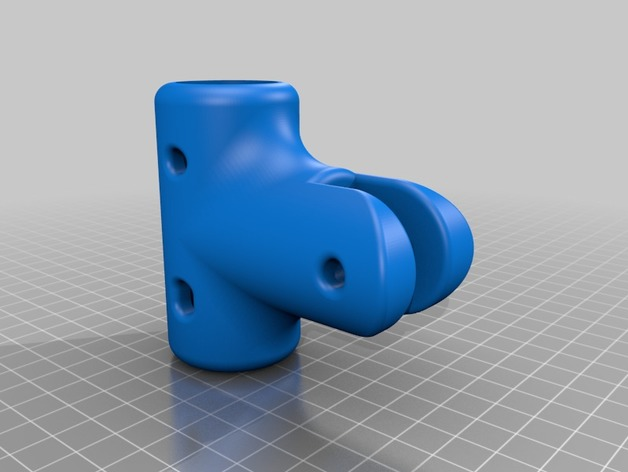
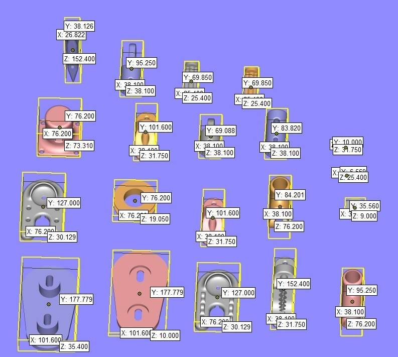

# Mast and rig solution Number 1

sharken sailing rig parts

1.	sail_base_screw_mount.stl
2.	sail_base_rope_mount.stl
3.	pully_pt1.stl
4.	pully_pt2.stl
5.	pully_pt3.stl
6.	mainsail_pully_baring.stl
7.	wheel.stl
8.	mainsail_pully.stl
9.	locking_pivot_base.stl
10.	locking_pin_through_hole_version.stl
11.	locking_pin.stl
12.	pin_cap.stl
13.	locking_pivot.stl
14.	solid_sail.stl
15.	folding_sail_pivot_base.stl

17.	folding_sail_pivot.stl
18.	sailing_clam_cleat_with_eye.stl
19.	cleat.stl
20.	sheet_eye.stl

